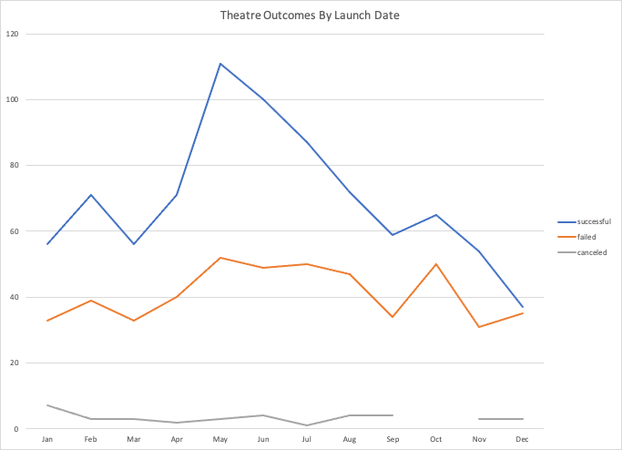
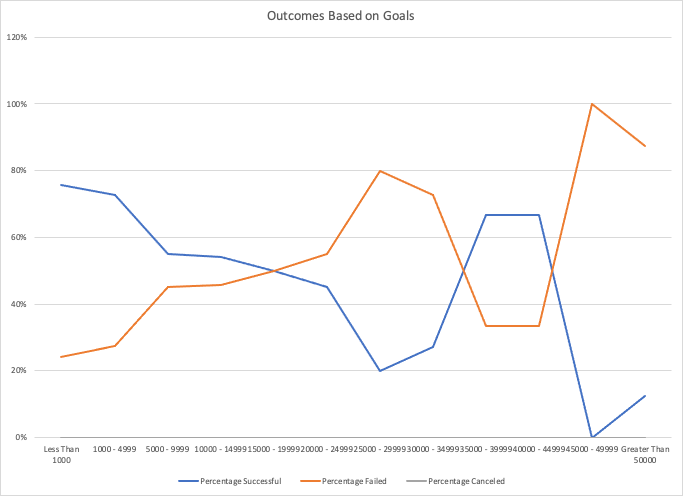

# Kickstarting with Excel
## Excel 

## Overview of Project
Louise is a director who recently held a Kickstarter campaign for her play, Fever. Fever achieved their funding goals. This project is to help Louise understand how other projects fared in their Kickstarter campaigns and whether there are any correlations of interest with other projects in regard to timing and goals.

### Purpose
The purpose of this analysis is to help Louise understand how other theatre and play kickstarter campaigns fared compared to her own project, Fever. The data will be presented visually for easier consumption.

## Analysis and Challenges

### Analysis of Outcomes Based on Launch Date

</img>

By interpreting the data we can see that the the most successful campaigns were launched between May and July, with the least successful campaigns launched in December. 

The canceled campaigns are fairly consistent and a low percentage of the overall theatre campaigns. The most canceled campaigns occur in January.

The highest ratio of failed campaigns to successful campaigns is during October and December. October has the highest rate of failed campaigns, but December has the highest ratio.

### Analysis of Outcomes Based on Goals
 </img>

The percentage of successful campaigns decreases as the goal increases up until the $25000-$29999 mark. The percentage of successful campaigns then rises again up until the $45000 mark, where it drops dramatically. The most successful campaigns are the ones with the lowest goals (Less than $1000 at 76% successful). There are significantly less campaigns that request more than $25000

There were no canceled campaigns for this dataset.

The percentage of failed campaigns is the inverse relationship, as there are no canceled campaigns. 

### Challenges and Difficulties Encountered

A challenge and difficulty I personally encountered was to do with the formatting of the second deliverable. The data needed to be sorted in a specific way to ensure that the x-axis variables were properly ordered. I overcame this difficulty by "moving" the row values around until they were in the correct order. 

A challenge with the data set is that the two deliverables are measuring for different variables. They would be more meaningful to Louis if they were both refering to either the parent company of Theatre or the subcategory of "plays" as she is trying to compare her success with other kickstarters in her field.

## Results

- What are two conclusions you can draw about the Outcomes based on Launch Date?

     1. Theatre campaigns are most successful when they are launched in May or June. This is also when the most campaigns are launched.

   2. The worst time to launch a campaign is in December or October. There is a 47% or 43% (respectively) chance of failure, with December having a close to even split of successful and failed campaigns.

- What can you conclude about the Outcomes based on Goals?

Based on sample size, the most successful campaigns are ones with a goal of under $5000.
The sample size is positively skewed, with the majority campaigns have goals of under $15000.

- What are some limitations of this dataset?

There is a positive skew of the Goals vs Outcomes data set as most of the sample has a goal of $20000 or less. Because the median is much lower than the mean, we know that there are some outliers. The outliers would be that there are 4 campaigns that received funding for over $40000.

The two datasets are also measuring different categories. The first measuring for the Parent Category "Theatre" and the second measuring the subcategory "plays".

- What are some other possible tables and/or graphs that we could create?

An interesting table/chart to create would be goal % outcome vs time elapsed (between launch date and deadline), this would give us some insight on how quickly we are able to tell if a project is likely to reach their funding goal.
